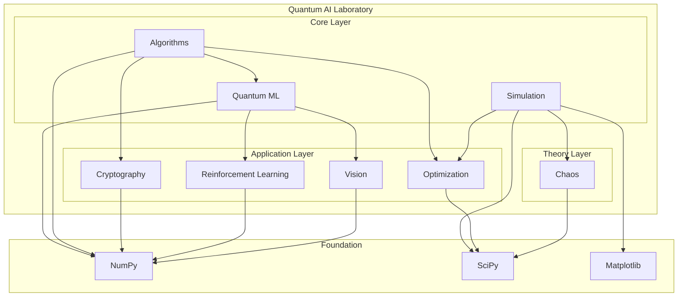

```
   ██████╗ ██╗   ██╗ █████╗ ███╗   ██╗████████╗██╗   ██╗███╗   ███╗
  ██╔═══██╗██║   ██║██╔══██╗████╗  ██║╚══██╔══╝██║   ██║████╗ ████║
  ██║   ██║██║   ██║███████║██╔██╗ ██║   ██║   ██║   ██║██╔████╔██║
  ██║▄▄ ██║██║   ██║██╔══██║██║╚██╗██║   ██║   ██║   ██║██║╚██╔╝██║
  ╚██████╔╝╚██████╔╝██║  ██║██║ ╚████║   ██║   ╚██████╔╝██║ ╚═╝ ██║
   ╚══▀▀═╝  ╚═════╝ ╚═╝  ╚═╝╚═╝  ╚═══╝   ╚═╝    ╚═════╝ ╚═╝     ╚═╝
           █████╗ ██╗    ██╗      █████╗ ██████╗
          ██╔══██╗██║    ██║     ██╔══██╗██╔══██╗
          ███████║██║    ██║     ███████║██████╔╝
          ██╔══██║██║    ██║     ██╔══██║██╔══██╗
          ██║  ██║██║    ███████╗██║  ██║██████╔╝
          ╚═╝  ╚═╝╚═╝    ╚══════╝╚═╝  ╚═╝╚═════╝
```

<div align="center">

# Quantum AI Laboratory

### *Where Quantum Mechanics Meets Artificial Intelligence*

[](https://python.org)
[](LICENSE)
[]()
[](https://numpy.org)
[](https://scipy.org)

---

*A comprehensive, production-grade Python monorepo for quantum computing research at the intersection of quantum mechanics and artificial intelligence. Eight self-contained modules covering the full spectrum of quantum AI — from cryptography to computer vision, from chaos theory to reinforcement learning.*

**No quantum hardware required.** Every algorithm runs on classical hardware via statevector simulation.

[Getting Started](#getting-started) •
[Modules](#modules) •
[Architecture](#architecture) •
[Examples](#examples) •
[Contributing](#contributing)

---

</div>

## Highlights

- **8 Research Modules** — covering the complete landscape of Quantum AI
- **Pure NumPy/SciPy** — no quantum hardware or SDK dependencies needed
- **Mathematically Rigorous** — every algorithm derived from first principles
- **Educational** — comprehensive docstrings with LaTeX-style formulas
- **Runnable Examples** — every module ships with executable demos
- **Production Architecture** — clean interfaces, type hints, modular design

## Modules

| Module | Description | Key Algorithms |
|--------|-------------|----------------|
| **[Quantum ML](quantum_ml/)** | Quantum Machine Learning | Quantum Kernels, VQC, QNN |
| **[Quantum Chaos](quantum_chaos/)** | Quantum Chaos Theory | Kicked Top, Level Spacing, OTOC |
| **[Quantum Crypto](quantum_crypto/)** | Quantum Cryptography | BB84, E91, Quantum OTP |
| **[Quantum Algorithms](quantum_algorithms/)** | Fundamental Algorithms | Grover, Shor, QFT, Deutsch-Jozsa |
| **[Quantum Simulation](quantum_simulation/)** | Many-Body Simulation | Ising, Hubbard, Trotter |
| **[Quantum Optimization](quantum_optimization/)** | Combinatorial Optimization | QAOA, VQE, MaxCut |
| **[Quantum RL](quantum_rl/)** | Reinforcement Learning | Quantum Policy, Hybrid Agent |
| **[Quantum Vision](quantum_vision/)** | Quantum Computer Vision | Quanvolution, FRQI, Hybrid CNN |

## Getting Started

### Prerequisites

```bash
Python >= 3.10
```

### Installation

```bash
# Clone the repository
git clone https://github.com/your-org/quantum-ai-lab.git
cd quantum-ai-lab

# Install dependencies
pip install -r requirements.txt

# Install as package (development mode)
pip install -e .
```

### Quick Start

```python
# 🔐 Generate a quantum-secure key with BB84
from quantum_crypto import BB84Protocol

bb84 = BB84Protocol()
key, stats = bb84.run_protocol(n_qubits=1000)
print(f"Shared key length: {stats.final_key_length} bits")
print(f"QBER: {stats.qber:.4f}")
print(f"Protocol secure: {stats.protocol_secure}")

# ⚙️ Factor a number with Shor's Algorithm
from quantum_algorithms import ShorFactoring

shor = ShorFactoring()
result = shor.factor(15)
p, q = result.factors
print(f"15 = {p} × {q}  (success={result.success})")

# 🤖 Train a Variational Quantum Classifier
from quantum_ml import VariationalClassifier
import numpy as np

X_train = np.random.rand(20, 2) * np.pi
y_train = (X_train[:, 0] > np.pi / 2).astype(int)
clf = VariationalClassifier(n_qubits=2, n_layers=2, random_state=42)
clf.train(X_train, y_train, epochs=50, verbose=False)
print(f"Train accuracy: {clf.accuracy(X_train, y_train):.1%}")

# 🧲 Simulate an Ising Model Phase Transition
from quantum_simulation import IsingModel

ising = IsingModel(n_sites=6, J=1.0, h=0.5)
E0, psi0 = IsingModel.ground_state(ising.hamiltonian)
mag_profile = IsingModel.magnetization(psi0, ising.n_sites)
print(f"Ground state energy: {E0:.4f}")
print(f"Avg magnetization:   {mag_profile.mean():.4f}")
```

## Architecture



##  Repository Structure

```
quantum-ai-lab/
├── README.md                          ← You are here
├── LICENSE
├── pyproject.toml
├── requirements.txt
├── docs/
│   └── architecture.md
│
├── quantum_ml/                        # Quantum Machine Learning
│   ├── qkernel.py                     #   Quantum Kernel Methods
│   ├── variational_classifier.py      #   Variational Quantum Classifier
│   ├── quantum_neural_net.py          #   Quantum Neural Network
│   └── examples/
│
├── quantum_chaos/                     # Quantum Chaos Theory
│   ├── kicked_top.py                  #   Kicked Top Model
│   ├── level_spacing.py               #   Level Spacing Statistics
│   ├── lyapunov.py                    #   Quantum Lyapunov Exponents
│   └── examples/
│
├── quantum_crypto/                    # Quantum Cryptography
│   ├── bb84.py                        #   BB84 QKD Protocol
│   ├── e91.py                         #   E91 Protocol
│   ├── quantum_otp.py                 #   Quantum One-Time Pad
│   └── examples/
│
├── quantum_algorithms/                # Fundamental Quantum Algorithms
│   ├── grover.py                      #   Grover's Search
│   ├── shor.py                        #   Shor's Factoring
│   ├── qft.py                         #   Quantum Fourier Transform
│   ├── deutsch_jozsa.py               #   Deutsch-Jozsa Algorithm
│   └── examples/
│
├── quantum_simulation/                # Quantum Many-Body Simulation
│   ├── ising_model.py                 #   Transverse-Field Ising Model
│   ├── hubbard_model.py               #   Fermi-Hubbard Model
│   ├── trotter.py                     #   Trotter Decomposition
│   └── examples/
│
├── quantum_optimization/              # Quantum Optimization
│   ├── qaoa.py                        #   QAOA
│   ├── vqe.py                         #   VQE
│   ├── max_cut.py                     #   MaxCut Solver
│   └── examples/
│
├── quantum_rl/                        # Quantum Reinforcement Learning
│   ├── quantum_policy.py              #   Quantum Policy Network
│   ├── hybrid_agent.py                #   Hybrid RL Agent
│   ├── quantum_environment.py         #   Environment Wrapper
│   └── examples/
│
└── quantum_vision/                    # Quantum Computer Vision
    ├── quanvolution.py                #   Quanvolutional Networks
    ├── quantum_encoder.py             #   Image Encoding
    ├── hybrid_classifier.py           #   Hybrid Classifier
    └── examples/
```

## Examples

Each module includes runnable examples in its `examples/` directory:

```bash
# Quantum Machine Learning — Iris Classification
python -m quantum_ml.examples.iris_classification

# Quantum Chaos — Visualization
python -m quantum_chaos.examples.chaos_visualization

# Quantum Cryptography — Secure Channel
python -m quantum_crypto.examples.secure_channel_demo

# Quantum Algorithms — Factoring
python -m quantum_algorithms.examples.factoring_demo

# Quantum Simulation — Phase Transitions
python -m quantum_simulation.examples.phase_transition_demo

# Quantum Optimization — Portfolio Optimization
python -m quantum_optimization.examples.portfolio_optimization

# Quantum RL — CartPole with Quantum Agent
python -m quantum_rl.examples.cartpole_quantum

# Quantum Vision — MNIST with Quantum Filters
python -m quantum_vision.examples.mnist_quantum
```

## Mathematical Foundations

This repository implements quantum algorithms from first principles. Key mathematical concepts:

| Concept | Notation | Module |
|---------|----------|--------|
| State Vector | \|ψ⟩ = Σ αᵢ\|i⟩ | All modules |
| Unitary Evolution | \|ψ(t)⟩ = U(t)\|ψ(0)⟩ | Simulation, Algorithms |
| Quantum Kernel | K(x,y) = \|⟨φ(x)\|φ(y)⟩\|² | ML |
| CHSH Inequality | S = \|E(a,b) - E(a,b') + E(a',b) + E(a',b')\| ≤ 2 | Crypto |
| Grover Iterate | G = (2\|ψ⟩⟨ψ\| - I) · Oₓ | Algorithms |
| Trotter Formula | e^{i(A+B)t} ≈ (e^{iAt/n}e^{iBt/n})ⁿ | Simulation |
| OTOC | C(t) = -⟨[W(t), V(0)]²⟩ | Chaos |
| QAOA | \|γ,β⟩ = e^{-iβₚB}e^{-iγₚC}···e^{-iβ₁B}e^{-iγ₁C}\|+⟩ | Optimization |

## Tech Stack

| Component | Technology | Purpose |
|-----------|------------|---------|
| **Core Language** | Python 3.10+ | All implementations |
| **Linear Algebra** | NumPy | State vectors, gates, operators |
| **Scientific Computing** | SciPy | Optimization, eigensolvers, matrix exponentials |
| **Visualization** | Matplotlib | Plots, diagrams, quantum state visualization |
| **Quantum (Optional)** | PennyLane / Qiskit | Real quantum hardware backends |

##  License

This project is licensed under the MIT License — see the [LICENSE](LICENSE) file for details.

##  References

1. Nielsen, M. A., & Chuang, I. L. (2010). *Quantum Computation and Quantum Information*. Cambridge University Press.
2. Schuld, M., & Petruccione, F. (2021). *Machine Learning with Quantum Computers*. Springer.
3. Preskill, J. (2018). Quantum Computing in the NISQ era and beyond. *Quantum*, 2, 79.
4. Farhi, E., Goldstone, J., & Gutmann, S. (2014). A Quantum Approximate Optimization Algorithm. *arXiv:1411.4028*.
5. Havlíček, V., et al. (2019). Supervised learning with quantum-enhanced feature spaces. *Nature*, 567, 209-212.
6. Haake, F. (2010). *Quantum Signatures of Chaos*. Springer.
7. Bennett, C. H., & Brassard, G. (1984). Quantum cryptography: Public key distribution and coin tossing. *TCS*, 560, 7-11.
8. Henderson, M., et al. (2020). Quanvolutional neural networks. *Quantum Science and Technology*, 5(3).

## Contributing

Contributions are welcome! Please feel free to submit a Pull Request. For major changes, please open an issue first to discuss what you would like to change.

## Project Status

This repository is currently under active development. Features and APIs are subject to change as we continue to expand and refine the implementations.

---

<div align="center">

**Built with love for the quantum computing community**

*Quantum AI Laboratory — Exploring the frontiers of quantum intelligence*

</div>
